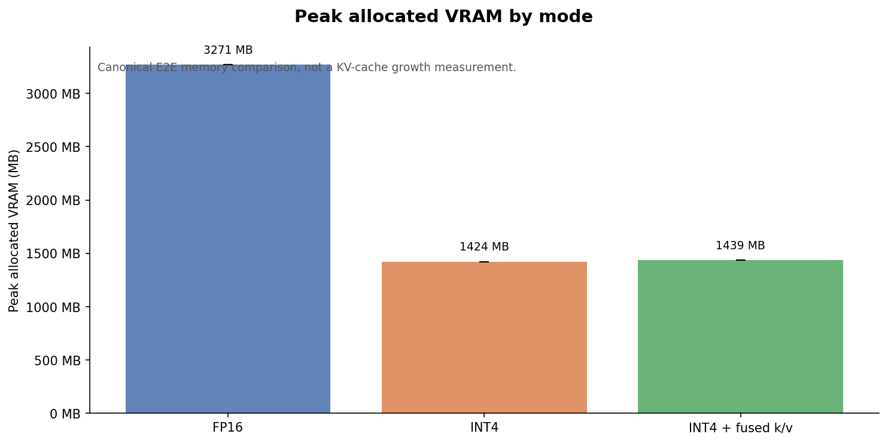
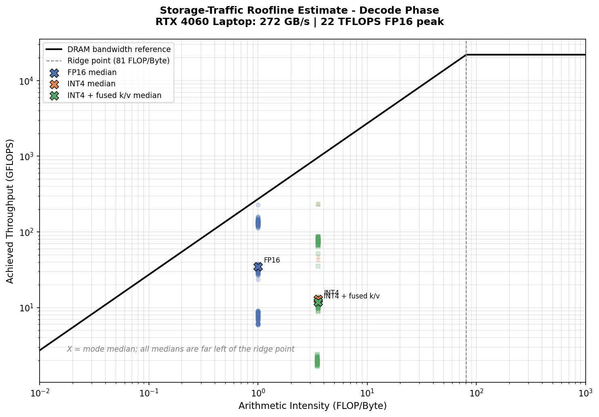

# Phase 3 Quantization Tax Report

## Executive Summary

- Primary performance numbers come from an end-to-end path with no profiler hooks attached.
- Per-layer CUDA Event timings are diagnostic measurements and are reported separately.
- bitsandbytes INT4 decode is **47.7% slower** than FP16.
- The fused k/v prototype differs by **1.0%** from bitsandbytes INT4; this run does not demonstrate an end-to-end gain.
- INT4 peak allocated VRAM is **56.5% lower** than FP16.

## Experiment Setup

- Model: `Qwen/Qwen2.5-1.5B-Instruct`
- Hardware: `NVIDIA GeForce RTX 4060 Laptop GPU`
- Prompt length: `512` tokens
- Decode length: `128` fixed steps
- E2E protocol: `8` warmups + `7` measured runs per mode
- Stability gate: Tukey outliers at most `15.0%`, retained decode CV at most `15.0%`, and IQR/median at most `30.0%`
- Python / PyTorch / CUDA: `3.11.15` / `2.5.1+cu121` / `12.1`
- Transformers / bitsandbytes / Triton: `5.3.0` / `0.49.2` / `3.1.0`
- NVIDIA driver: `610.47`
- Windows host power plan: `电源方案 GUID: 8c5e7fda-e8bf-4a96-9a85-a6e23a8c635c  (高性能)`
- Git commit / dirty: `b2926d1cfb4db5418a7f42e9b858f578511d479c` / `False`
- Retained decode CV by mode: `fp16` 10.7%, `int4` 4.9%, `int4-fused-kv` 13.7%

## Canonical End-to-End Results

| Mode | Prefill | Decode | Throughput | Peak allocated VRAM |
|------|---------|--------|------------|---------------------|
| FP16 | 0.082 s (std 0.130) | 10.635 s (std 1.161) | 12.04 tok/s (std 1.24) | 3271.3 MB (std 0.0) |
| INT4 | 0.146 s (std 0.120) | 15.706 s (std 1.789) | 8.15 tok/s (std 1.23) | 1423.5 MB (std 0.0) |
| INT4 + fused k/v | 5.290 s (std 0.753) | 15.857 s (std 4.468) | 8.07 tok/s (std 1.52) | 1439.3 MB (std 0.0) |

The fused path is a correctness-first GEMV prototype for 56 k/v projections, not a full quantized inference engine.

## How to Read the Figures

Figures 1, 3, and 4 come from diagnostic profile runs with CUDA Event hooks. Figure 2 uses canonical E2E peak-memory data. The diagnostic figures explain where the slowdown is concentrated; they are not the source of the E2E table above.

### Figure 1: Decode slowdown across all layers

Read the y-axis as INT4 latency change relative to FP16. Positive values are slower; orange markers isolate `k_proj`/`v_proj`. The purpose is to see whether the tax is isolated or distributed across the model.

### Figure 2: Peak allocated VRAM by mode

This is a memory comparison, not a KV-cache growth curve. The main readout is the lower INT4 baseline and whether the fused prototype changes it.

### Figure 3: Top-10 layer-level slowdowns

This is the optimization priority list. Orange bars are k/v projections; gray bars are other layers. In this run, all ten entries are k/v projections.

### Figure 4: Storage-traffic Roofline estimate

The faint points are individual layers and X markers are mode medians. All medians are far left of the ridge point, so the profile is not compute-saturated; this plot is a location/scale diagnostic, not a causal proof of the slowdown.

## Worst INT4 Layers

| Layer | FP16 hook ms | INT4 hook ms | Fused hook ms | INT4 slowdown |
|-------|--------------|--------------|---------------|---------------|
| `model.layers.8.self_attn.k_proj` | 0.088 | 0.420 | 0.412 | +378.5% |
| `model.layers.13.self_attn.v_proj` | 0.090 | 0.430 | 0.452 | +377.6% |
| `model.layers.7.self_attn.v_proj` | 0.088 | 0.415 | 0.400 | +369.6% |
| `model.layers.7.self_attn.k_proj` | 0.091 | 0.421 | 0.427 | +360.7% |
| `model.layers.14.self_attn.v_proj` | 0.086 | 0.390 | 0.429 | +354.4% |
| `model.layers.8.self_attn.v_proj` | 0.087 | 0.389 | 0.389 | +348.9% |
| `model.layers.10.self_attn.k_proj` | 0.091 | 0.405 | 0.444 | +344.4% |
| `model.layers.1.self_attn.k_proj` | 0.091 | 0.403 | 0.365 | +342.2% |
| `model.layers.13.self_attn.k_proj` | 0.092 | 0.402 | 0.439 | +339.2% |
| `model.layers.9.self_attn.k_proj` | 0.096 | 0.420 | 0.456 | +336.0% |

## Interpretation Boundaries

- This experiment directly supports the observed latency and VRAM tradeoff on the stated hardware and software stack.
- For eligible batch-1 decode shapes, bitsandbytes 0.49.2 dispatches to a dedicated CUDA `gemv_4bit` path rather than materializing a full FP16 weight tensor in the Python/PyTorch path.
- The storage-traffic Roofline estimate models packed FP4 weights and block scales, but not unpack/codebook/scale instruction cost, occupancy, launch overhead, or cache behavior. The exact kernel bottleneck still requires Nsight-level profiling.
- The fused k/v result only evaluates the current Python wrapper and Triton prototype. It should not be generalized to optimized fused INT4 kernels.

## Reproducibility

- Machine-readable summary: `results/canonical.json`
- Raw E2E metadata and layer CSVs are generated under `data/phase3/` and intentionally gitignored.
- Recreate all public artifacts from WSL after activating the setup environment: `python scripts/run_phase3.py --local-files-only`.
- On this Windows laptop, use `powershell -ExecutionPolicy Bypass -File scripts/run_phase3_windows.ps1 -LocalFilesOnly` to temporarily select and then restore the High performance host plan.
