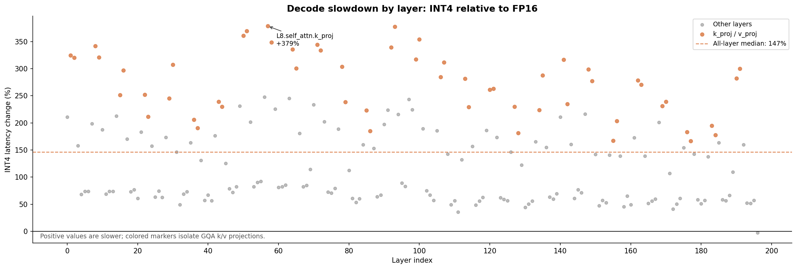
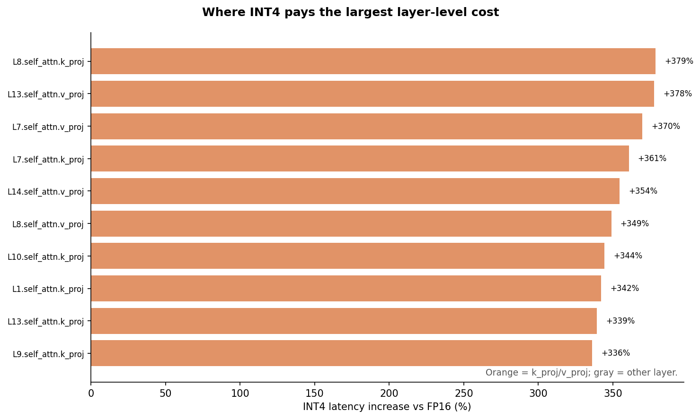

# llm-quant-profiler

一个用于测量 FP16 与 bitsandbytes FP4 LLM 推理 latency–memory tradeoff 的单 GPU profiler。

在 Qwen2.5-1.5B-Instruct 和 RTX 4060 Laptop GPU 上，controlled no-hook benchmark 显示：bitsandbytes INT4 的峰值 allocated VRAM 比 FP16 **低 56.5%**，但 decode latency **高 47.7%**。同一轮中，通过 correctness 验证的 Triton fused k/v prototype 与 bitsandbytes INT4 baseline 相差 **1.0%**，不能据此声称端到端加速。

**Canonical artifacts：**[完整报告](PHASE3_REPORT.md) · [机器可读 JSON](results/canonical.json) · [English README](README.md)

## 实测结果

| 模式 | Prefill | Decode | Decode throughput | Peak allocated VRAM |
|------|---------|--------|-------------------|---------------------|
| FP16 | 0.082 s（std 0.130） | 10.635 s（std 1.161） | 12.04 tok/s（std 1.24） | 3271.3 MB |
| INT4（bitsandbytes FP4） | 0.146 s（std 0.120） | 15.706 s（std 1.789） | 8.15 tok/s（std 1.23） | 1423.5 MB |
| INT4 + fused k/v prototype | 5.290 s（std 0.753） | 15.857 s（std 4.468） | 8.07 tok/s（std 1.52） | 1439.3 MB |

*Qwen/Qwen2.5-1.5B-Instruct · RTX 4060 Laptop GPU · 512-token prompt · 128 个固定 decode steps · 每种模式 8 次 warmup + 7 次正式测量 · E2E 不挂 hooks · 表中为 median 与 sample standard deviation · 预先定义的 stability gate 已通过 · Windows 高性能 host plan · PyTorch 2.5.1+cu121 · Transformers 5.3.0 · bitsandbytes 0.49.2 · Triton 3.1.0*

主表来自**完全不挂 profiler hooks** 的 E2E 路径。CUDA Event layer profiling 单独运行，只用于诊断和生成下方图表。

## Profile 说明了什么

- INT4 在这张 8GB GPU 上显著降低 allocated memory，但测试的 bitsandbytes FP4 路径在 batch-1 decode 中仍然更慢。
- 本次 relative slowdown 最大的十层都是 GQA `k_proj` 或 `v_proj`。
- Storage-based Roofline estimate 预计 INT4 读取的 weight bytes 更少，但实测 latency 反而明显更高，因此 compression 本身不保证 kernel 更快。
- bitsandbytes 0.49.2 对符合条件的 batch-1 decode shape 会 dispatch 到专用 CUDA `gemv_4bit` 路径。剩余瓶颈可能来自 on-the-fly unpack/scale、instruction mix、occupancy、launch overhead 或 shape-specific kernel efficiency；本 repo 尚未把这些原因逐一隔离。
- Fused k/v 实现是 correctness-first GEMV prototype。当前 Python wrapper 对每个 token row 启动一个 Triton kernel；与 bitsandbytes 的 1.0% 差异落在本轮的 run-to-run variation 内，不能视为端到端收益。





## 图表怎么读

- **图 1：逐层 decode slowdown：** y 轴是 INT4 相对 FP16 的 latency 变化；橙色点单独标出 `k_proj`/`v_proj`，回答 slowdown 是局部还是广泛分布。
- **图 2：Peak allocated VRAM：** 直接比较三种模式的 canonical E2E 显存基线；它不再冒充 KV-cache growth 图，因为本实验没有单独隔离 cache 增长。
- **图 3：Top-10 layer cost：** 优化优先级列表；橙色是 k/v projections，灰色是其他层。
- **图 4：Storage-traffic Roofline：** 浅色点是单层结果，X 是模式 median；所有 median 都远在 ridge point 左侧，这张图用于定位 workload，不是 slowdown 的因果解释。

## 测量设计

`scripts/run_benchmark.py` 明确拆分两条路径：

- `--measurement-mode e2e`：不注册任何 hooks；prefill 和 decode 使用同一条指定长度的 prompt；固定生成 decode steps；输出 wall time、throughput、peak allocated/reserved VRAM。
- `--measurement-mode profile`：给 197 个目标层注册 CUDA Event hooks 并输出逐层 CSV。逐层同步会改变 wall time，因此 profile run 不进入主性能结果。

Canonical runner 会在 FP16、INT4、INT4-fused-k/v 三种模式下分别执行两条路径，记录 package、GPU、driver、Git metadata 与 Windows host power plan，通过预先定义的 stability gate 后才重新生成四张图和公开报告、JSON summary。

## 复现

在带 NVIDIA GPU 的 WSL2 中运行：

```bash
bash setup.sh
source ~/.venvs/llm-quant-profiler/bin/activate
python scripts/run_phase3.py --local-files-only
```

在这台 Windows laptop 上，建议使用 host wrapper 跑 controlled canonical：它会临时切换到高性能电源计划，并在结束后恢复原计划。

```powershell
powershell -ExecutionPolicy Bypass -File scripts/run_phase3_windows.ps1 -LocalFilesOnly
```

如果 Hugging Face model 尚未缓存，第一次运行时移除 `--local-files-only`。

快速 E2E smoke test：

```bash
python scripts/run_benchmark.py \
  --quantization fp16 \
  --measurement-mode e2e \
  --prompt-len 32 \
  --max-new-tokens 8 \
  --warmup-runs 0 \
  --repeats 1
```

Raw metadata 和 layer CSV 写入 gitignored `data/`。公开 artifacts 写入 `results/canonical.json`、`PHASE3_REPORT.md` 和 `outputs/`。

## 解释边界

- 结果只对应单一模型、单一消费级 GPU、batch size 1 和上方列出的软件版本。
- Roofline 图只估算 packed FP4 storage 和 block scales，不包含 unpack/codebook/scale instruction cost、occupancy 或 cache behavior。
- 在上述 controlled protocol 下，latency–VRAM tradeoff 已经测量确认；确切 CUDA-kernel bottleneck 仍需 Nsight 或同等级 kernel profiling。
- 自定义 kernel 只替换 56 个 k/v projections，不是通用 INT4 inference engine，也不能外推到 production fused kernels。
